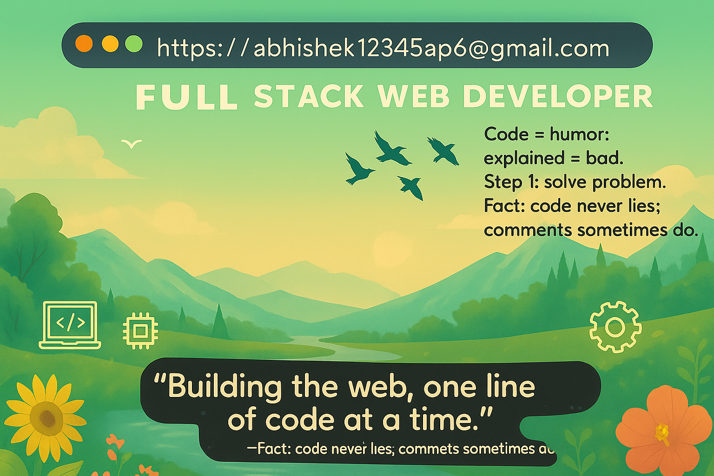

<!-- Typing Animation -->
<h1 align="center">
  
</h1>

<h2 align="center">👨‍💻 Compile. Crash. Debug. Repeat.</h2>

---

## 🙋‍♂️ About Me
I’m a passionate and self-motivated **Full-Stack .NET Developer** who loves transforming ideas into **interactive and visually appealing digital experiences**.  
With strong expertise in **VB.NET**, **ASP.NET Web Forms**, **SQL Server**, and front-end technologies like **HTML**, **CSS**, and **JavaScript**, I build **responsive, database-driven applications** that are both **functional** and **user-friendly**.

I’m not just a developer — I’m a **problem-solver** who enjoys **finding elegant solutions to complex challenges**. Whether it’s **optimizing a SQL query**, **designing a clean UI**, or **creating a seamless user flow**, I focus on **quality, performance, and creativity** in every project.

---

### 🔭 Currently Working On
- ASP.NET Web Forms projects  
- VB.NET Windows Forms applications  
- JavaScript mini-projects  

### 🌱 Currently Learning
- Advanced Data Structures  
- System Design  
- Backend Optimization  
- Modern UI/UX Practices  

### 💬 Ask Me About
- SQL Server, VB.NET, ASP.NET Web Forms, HTML, CSS, JavaScript  
- Building complete full-stack applications  

📫 **Email me:** [abhishek12345ap6@gmail.com](mailto:abhishek12345ap6@gmail.com)  

---

## 🛠 SEO-Friendly Skills & Technologies

  

**Specialization:**  
Full-Stack .NET Development, Responsive Web Design, CRUD Applications, Dashboard UI, Data Visualization  

**Other Skills:**  
Problem-Solving, Project Planning, Freelancing, Client Communication  

---

## 📂 Highlighted Projects

- **📚 Book Store System (ASP.NET + SQL Server)**  
  A complete e-commerce-style book store with **search/filter options**, **cart & checkout**, **order history**, and **admin control panel**.

- **📝 Complaint Management System (VB.NET + SQL Server)**  
  A desktop application allowing users to register complaints with **image uploads**, track complaint status, and generate reports.

---

## 🆕 Latest Projects
*(Updated automatically via GitHub API)*

<!-- LATEST-PROJECTS:START -->
- [Book Store System](https://github.com/AbhishekPandey5001/Book-Store-System) – ASP.NET + SQL Server e-commerce platform
- [Complaint Management System](https://github.com/AbhishekPandey5001/Complaint-Management-System) – VB.NET + SQL Server complaint tracker
- [JavaScript Mini Projects](https://github.com/AbhishekPandey5001/JavaScript-Projects) – Fun, interactive web components
<!-- LATEST-PROJECTS:END -->

---

## 📊 GitHub Stats & Streaks

  

  

  

  

---

## 🐍 GitHub Contribution Snake
<!-- Light mode -->
  

<!-- Dark mode -->
  

<!-- Ocean gif (optional) -->

